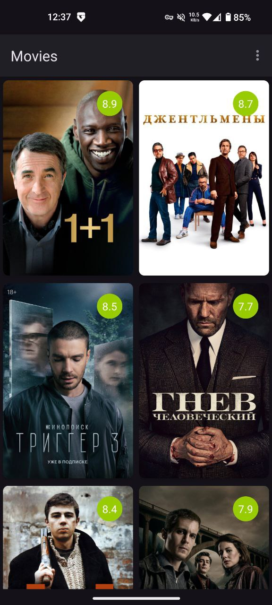
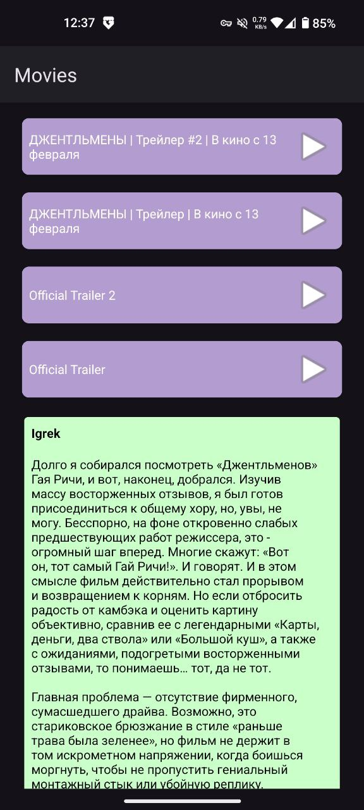

# Movie Catalog App 🎬

Android‑приложение для просмотра каталога фильмов с **Кинопоиска**. Позволяет получать информацию о фильмах, читать отзывы, смотреть трейлеры и добавлять фильмы в избранное. Проект создан как **портфолио‑приложение** для демонстрации навыков Android‑разработки.

---

## 📱 О проекте

Movie Catalog App демонстрирует работу с сетевым API, локальным хранилищем и асинхронными потоками данных. Приложение построено с упором на разделение ответственности, читаемость кода и практическое применение классического Android‑стека на **Java**.

---

## 🛠️ Технологический стек

- **Язык:** Java
    
- **Сеть:** Retrofit
    
- **Асинхронность:** RxJava
    
- **Локальное хранилище:** Room
    
- **Загрузка изображений:** Glide
    

---

## 🧱 Архитектура

Проект реализован с разделением на логические слои:

- `ui` — Activities / Fragments, отображение данных
    
- `data` — работа с API и базой данных
    
- `model` — модели данных
    
- `repository` — единая точка доступа к данным
    

---

## ✨ Основные возможности

- просмотр списка популярных фильмов
    
- просмотр детальной информации о фильме
    
- чтение отзывов
    
- просмотр трейлеров
    
- добавление и удаление фильмов из избранного
    
- сохранение избранных фильмов локально
    

---

## 🖼️ UI

  
  
  

    

---
## 🎯 Что демонстрирует проект

- работу с REST API
    
- использование RxJava для асинхронных операций
    
- кэширование данных с помощью Room
    
- реализацию паттерна Repository
    
- работу с изображениями через Glide
    
- классический Android‑подход без Compose
    

---

## 🚀 Возможные улучшения

-  Добавить pagination
    
-  Реализовать поиск по каталогу
    
-  Добавить unit‑тесты
    
-  Перейти на MVVM
    
